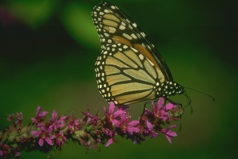
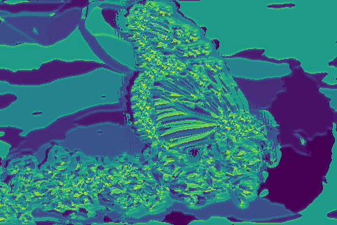

# Probability_based_Boundary_Detection

This repository consists of comparison of baseline edge detection algorithms like Canny and Sobel with [Probability of boundary detection algorithm](https://www2.eecs.berkeley.edu/Research/Projects/CS/vision/grouping/papers/amfm_pami2010.pdf). A simpler version of PB algorithm has been implemented which considers texture, color and intensity discontinuities. This algorithm predicts per pixel probability of the boundary detected. The original image and the output of implementation is shown below:

 

The algorithm of PBLite detection is shown below:


The main steps for implementing the same are:

## Step 1: Feature extraction using Filtering
The filter banks implemented for low-level feature extraction are Oriented Derivative if Gaussian Filters, Leung-Malik Filters (multi-scale) and Gabor Filter.

  

## Step 2: Extracting texture, color and brightness using clustering
Filter banks can be used for extraction of texture properties but here all the three filter banks are combined which results into vector of filter responses. As filter response vectors are generated, they are clustered together using k-means clustering. For Texton Maps k = 64 is used; Color and Brightness Maps k= 16 is used.


  

The gradient measurement is performed to know how much all features distribution is changing at a given pixel. For this purpose, half-disc masks are used.

  

## Step 3: Pb-Score
The gradient maps which are generated are combined with classical edge detectors like Canny and Sobel baselines for weighted avaerage.

## Run Instructions
```
python Wrapper.py
```
